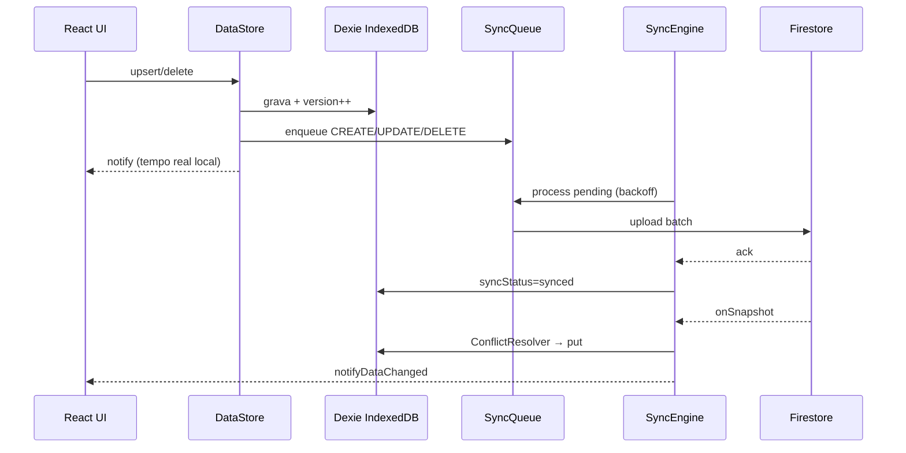

# Arquitetura Offline-First — App TAF

## 1. Diagnóstico (problemas encontrados)

| Problema | Impacto | Status |
|----------|---------|--------|
| 3 bancos IndexedDB separados sem schema unificado | Cache inconsistente, migração frágil | **Corrigido** — Dexie `taf_offline_first_v1` |
| UI lia Firestore indiretamente via sync a cada `getAll*` | Lentidão, barra travada, fila de syncs | **Corrigido** — leitura só do Dexie |
| `conflictMerge.ts` não usado; replace remoto cego | Sobrescrita indevida | **Corrigido** — `ConflictResolver.ts` |
| `navigator.onLine` como único critério | Falso online/offline | **Corrigido** — `ConnectivityMonitor` |
| Sem fila formal CREATE/UPDATE/DELETE | Perda em oscilação de rede | **Corrigido** — `SyncQueue` |
| Exclusão física imediata | Dados sumiam antes do sync | **Corrigido** — soft delete |
| Realtime substituía cache sem versão | Conflitos multi-dispositivo | **Corrigido** — apply com resolver |
| Sem auditoria | Difícil diagnosticar | **Corrigido** — `syncLogs` + painel |
| Motor legado `offlineCloudEngine` monolítico | Duplicação, mutex opaco | **Mantido como fallback** nativo sem Dexie |

## 2. Arquitetura proposta

```
React (telas)
    ↓
cadastrosIndexedDb / resultadosAplicadosIndexedDb (facade)
    ↓
DataStore (store central)
    ↓
localDb + Dexie (IndexedDB principal)
    ↓
SyncQueue (operações pendentes)
    ↓
SyncEngine (upload + pull + backoff)
    ↓
RealtimeBridge (onSnapshot → ConflictResolver → Dexie)
    ↓
Firebase Firestore (somente sincronização)
```

## 3. Fluxograma de sincronização



## 4. Arquivos criados

```
src/offline-first/
  types.ts
  deviceId.ts
  index.ts
  db/tafDatabase.ts
  db/localDb.ts
  db/migration.ts
  sync/ConflictResolver.ts
  sync/SyncQueue.ts
  sync/SyncLogger.ts
  sync/ConnectivityMonitor.ts
  sync/SyncEngine.ts
  sync/RealtimeBridge.ts
  store/DataStore.ts
  store/DataStoreContext.tsx
src/components/SyncDiagnosticsPanel.tsx
public/sw.js
tests/offline-first/ConflictResolver.test.ts
vitest.config.ts
docs/OFFLINE_FIRST_ARCHITECTURE.md
```

## 5. Arquivos modificados

- `App.tsx` — DataStoreProvider + Service Worker
- `package.json` — dexie, vitest
- `AuthContext.tsx` — init SyncEngine + migração
- `OfflineSyncContext.tsx` — motor novo
- `cadastrosIndexedDb.ts` / `resultadosAplicadosIndexedDb.ts` — facade offline-first
- `cloudDataSync.ts` — Home lê Dexie
- `useAuthDataReload.ts` — subscribe DataStore
- `ConfiguracoesScreen.tsx` — painel diagnóstico

## 6. Metadados por registro

Todo registro no Dexie inclui: `createdAt`, `updatedAt`, `version`, `deviceId`, `userId`, `syncStatus`, `deleted`, `deletedAt`, `deletedBy`, `lastModifiedBy`, `ownerUid`.

## 7. Estados de conectividade

- **ONLINE** — internet + Firestore OK
- **DEGRADED** — internet OK, Firestore instável
- **OFFLINE** — sem rede
- **SYNCING** — motor processando fila

## 8. Plano de testes

| Cenário | Como validar |
|---------|--------------|
| Offline puro | Desligar rede, cadastrar, recarregar — dados no Dexie |
| Online multi-device | Dois browsers, alterar em A, ver em B via realtime |
| Conflito | Editar mesmo NIP offline em 2 devices, reconectar — version wins |
| Oscilação | Throttling 3G, aplicar TAF — fila > 0 depois synced |
| Soft delete | Excluir offline, sync — some após ack remoto |
| Migração | Login com dados legados — aparecem no Dexie |

Testes automatizados: `npm test` (ConflictResolver). Meta 90%: expandir para SyncQueue, ConnectivityMonitor, localDb.

## 9. Checklist de validação

- [ ] Login → nuvem verde, cadastros carregam
- [ ] Offline → nuvem vermelha, CRUD funciona
- [ ] Reconexão → fila esvazia automaticamente
- [ ] Chefe + autorizado veem mesmos dados
- [ ] Configurações → diagnóstico mostra logs
- [ ] Recarregar página não perde dados
- [ ] 865+ cadastros sem travar (paginação futura se necessário)

## 10. Melhorias futuras

- Paginação Firestore + Dexie para 50k+ registros
- Sync de rubricas (`cadastro_rubricas`) via fila dedicada
- Background Sync API no Service Worker
- Remover `offlineCloudEngine` após estabilização
- Cobertura de testes 90%+
